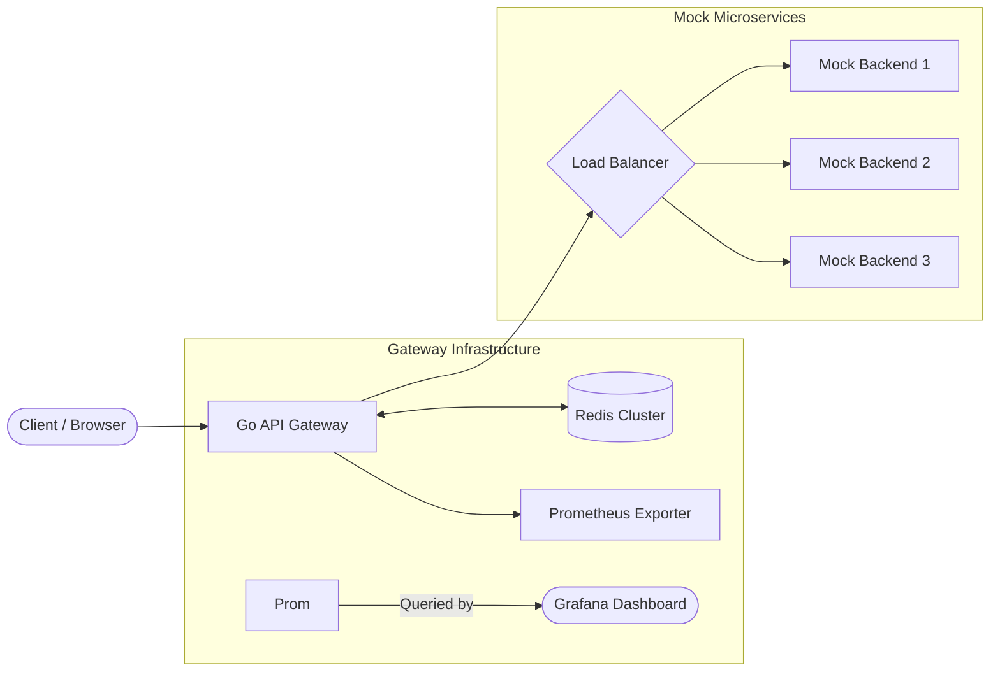
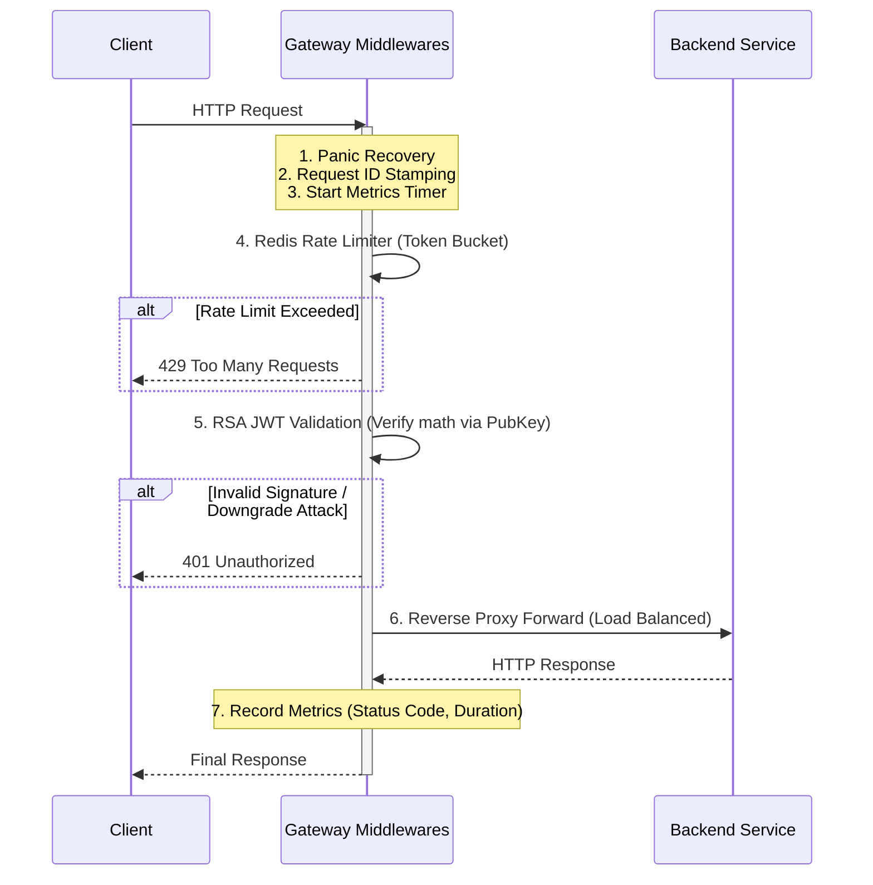
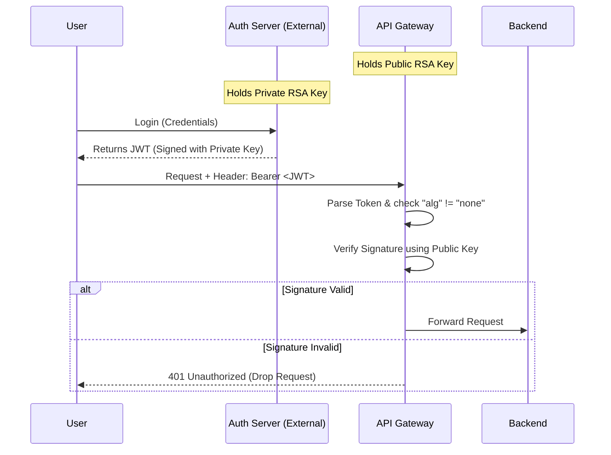
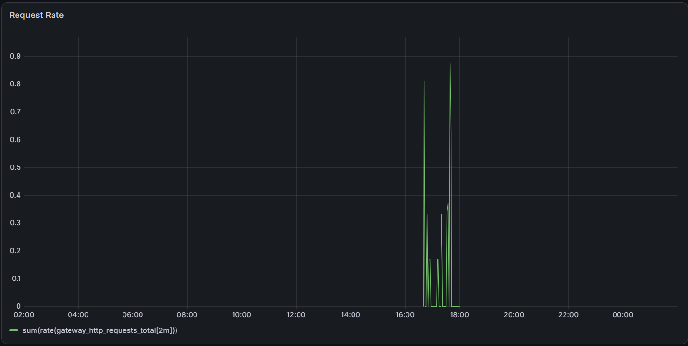
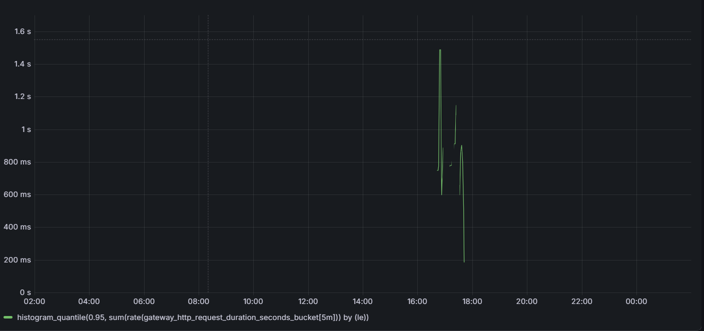
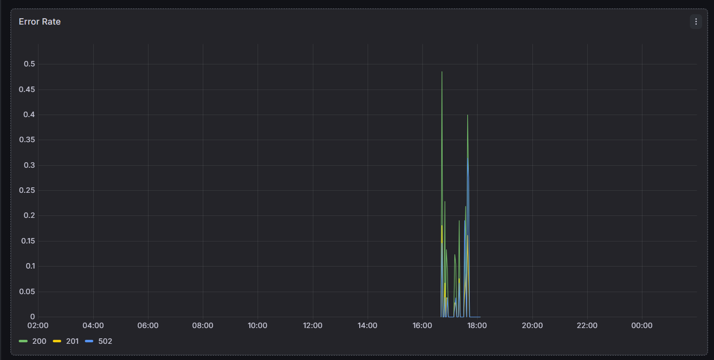

# 🛡️ Enterprise Go API Gateway


A high-performance, production-ready API Gateway built in Go. This gateway acts as the single point of entry for microservices, handling routing, distributed rate-limiting, asymmetric cryptographic security, and load balancing, all fully instrumented with Prometheus and Grafana.

## 📑 Table of Contents

- ✨ Feature Checklist
- 🏗️ Architecture
- 🌊 API Request Flow
- 🔐 JWT Authentication Flow
- 📊 Observability
- 📁 Project Structure
- 🚀 Getting Started
- 💻 Testing & Development
- 🔮 Future Improvements
- 📜 License

## ✨ Feature Checklist

- [x] **Custom Reverse Proxy:** Safe context cloning and HTTP stream forwarding.
- [x] **High-Availability Load Balancing:** Round-robin routing with exponential backoff and circuit breaking.
- [x] **Distributed Rate Limiting:** Redis-backed atomic Token Bucket using Lua scripting.
- [x] **Impenetrable Edge Security:** Asymmetric RSA-backed JWT validation (Algorithm downgrade protection).
- [x] **Resiliency:** Middleware pipelines, panic recovery, and graceful OS shutdown (No dropped connections).
- [x] **Observability:** Golden Signal tracking (Rate, Errors, Duration) via Prometheus.
- [x] **Local Testing Environment:** Included mock servers (CRUD) and automated RSA token generation scripts.

---

## 🏗️ Architecture

The gateway sits at the edge of the network, catching all incoming traffic. Requests pass through a strict middleware onion before being load-balanced across available backend instances.

To validate the load balancing and routing logic, this repository includes **Mock Backend Servers**. These servers expose dummy endpoints supporting `GET`, `POST`, `PUT`, and `DELETE` without requiring a real database, allowing for pure network and proxy testing.



### 🌊 API Request Flow

Every request is filtered through a structured middleware chain. If any middleware fails (e.g., rate limit exceeded, invalid token), the request is dropped immediately before reaching the backend.



### 🔐 JWT Authentication Flow

The gateway uses Asymmetric RSA Keys (RS256). It never needs to talk to an external Auth database; it validates the cryptographic math locally using a public .pem key, saving massive network overhead.



### 📊 Observability (Prometheus & Grafana)

The gateway exports RED (Rate, Errors, Duration) metrics natively at `/metrics`.

Metrics tracked include:

- `gateway_http_requests_total` (Counter mapped by Method, Path, and Status Code)
- `gateway_http_request_duration_seconds` (Histogram mapped by Method, Path)

### 📈 Grafana Dashboard

The gateway exports RED metrics which are visualized through Grafana.

#### Request Throughput


#### Request Latency


#### Error Rate


## 📁 Project Structure

```text
.
├── backend-server/         # Mock servers implemetation and its Dockerfile
├── cmd/                    # Application entrypoints
├── docs/                   # Dashboard screenshots
├── internal/             
│   ├── config/             # Configuration management
│   ├── health/             # Backend Heath check implementation
│   ├── loadbalancer/       # Routing, retries, circuit breakers
│   └── middleware/         # Rate limiting, RS256 JWT validation, logging, tracing, Prometheus instrumentation
├── tests/                  # JWT generation and Rate limiting test
├── config.yaml             # Configration of routes, middlewares and backends 
├── docker-compose.yml      # Local infrastructure stack
├── Dockerfile              # Gateway's Dockerfile
├── private.pem             # Dummy private key
├── prometheus.yaml         # Prometheus configration
├── public.pem              # Dummy public key 
└── README.md
```

## 🚀 Getting Started

### 1. Start the Infrastructure (Docker Compose)

The entire stack (API Gateway, mock backends, Redis, Prometheus, and Grafana) is orchestrated via Docker.

```bash
# Build and start all containers in detached mode
docker-compose up --build -d
```

### 2. Verify Services are Running

- API Gateway: http://localhost:8080
- Prometheus: http://localhost:9090
- Grafana: http://localhost:3000 (Login: admin / admin)

## 💻 Testing & Development

Because this gateway requires asymmetric RSA signatures for authentication, a test script is included to act as an external authentication server.

### 1. Generate a valid JWT

Run the included test script to sign a payload using the private RSA key and execute an automated test request:

```bash
go run tests/generate_jwt.go
```

### 2. Manual cURL Commands

You can also manually test the endpoints and load balancing using the commands below.

Access a protected route (Will fail without token):

```bash
curl -i http://localhost:8080/users
# Expected: 401 Unauthorized
```

Pass a valid JWT (Replace `<YOUR_TOKEN>`):

```bash
curl -i -H "Authorization: Bearer <YOUR_TOKEN>" -X POST http://localhost:8080/users
# Expected: 200 OK (Routed to Mock Backend)
```

Trigger the Rate Limiter (Run repeatedly):

```bash
for i in {1..20}; do curl -i -H "Authorization: Bearer <YOUR_TOKEN>" http://localhost:8080/users; done
# Expected: 429 Too Many Requests
```

## 🔮 Future Improvements

Potential future roadmap items include:

- Dynamic Configuration: Implement a file watcher (like fsnotify) to hot-reload routes and rate limits without restarting the binary.
- Distributed Tracing: Integrate OpenTelemetry to inject trace IDs across microservice boundaries (Jaeger/Zipkin).
- gRPC Support: Expand reverse proxy capabilities to multiplex gRPC traffic alongside HTTP/1.1.

## 📜 License

This project is licensed under the MIT License. See the [LICENSE](LICENSE) file for details.

